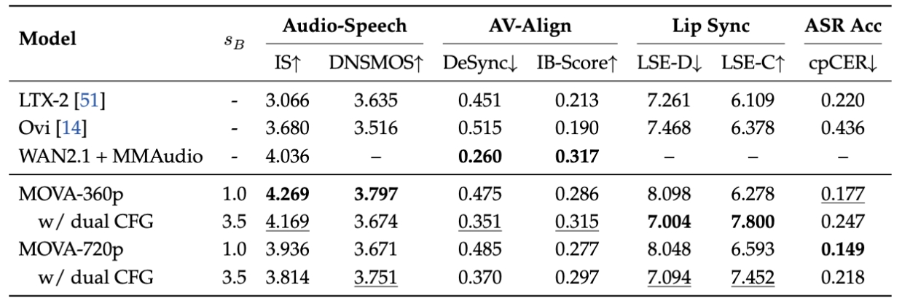

<p align="center">
    
</p>

<div align="center">
    <a href="https://github.com/OpenMOSS/MOVA"></a>
    <a href="https://huggingface.co/collections/OpenMOSS-Team/mova"></a>
    <a href="https://mosi.cn/models/mova"></a>
    <a href="https://github.com/OpenMOSS/MOVA"></a>
</div>
<div align="center">
    <a href="https://discord.gg/J2BBgVMRVZ"></a>
    <a href="https://x.com/Open_MOSS"></a>
    <a href="https://gist.github.com/user-attachments/assets/abf31f41-55d3-4e4e-9f25-966bf6d23fc1"></a>
</div>

## MOVA: Towards Scalable and Synchronized Video–Audio Generation
We introduce **MOVA** (**MO**SS **V**ideo and **A**udio), a foundation model designed to break the "silent era" of open-source video generation. Unlike cascaded pipelines that generate sound as an afterthought, MOVA synthesizes video and audio simultaneously for perfect alignment.

🌟Key Highlights
- **Native Bimodal Generation**: Moves beyond clunky cascaded pipelines. MOVA generates high-fidelity video and synchronized audio in a single inference pass, eliminating error accumulation.
- **Precise Lip-Sync & Sound FX**: Achieves state-of-the-art performance in multilingual lip-synchronization and environment-aware sound effects.
- **Fully Open-Source**: In a field dominated by closed-source models (Sora 2, Veo 3, Kling), we are releasing model weights, inference code, training pipelines, and LoRA fine-tuning scripts. 
- **Asymmetric Dual-Tower Architecture**: Leverages the power of pre-trained video and audio towers, fused via a bidirectional cross-attention mechanism for rich modality interaction.

## 🔥News!!!
- 2026/01/29: 🎉We released **MOVA**, an open-source foundation model for high-fidelity synchronized video–audio generation!!!

## 🎬Demo
<div align="center">
  <video src="https://gist.github.com/user-attachments/assets/cee573cc-56ce-4987-beef-0b374e1ed3b7" width="70%" poster=""> </video>
</div>

Single person speech:
<details>
  <summary>Click to expand</summary>
  <video src="https://gist.github.com/user-attachments/assets/118a6597-054b-4bb9-812a-c225e93f12f7" width="70%"></video>
</details>

Multi-person speech:
<details>
  <summary>Click to expand</summary>
  <video src="https://gist.github.com/user-attachments/assets/a11b1d1e-b0da-4c45-9aeb-c74a64131b6d" width="70%"></video>
</details>

View more demos on our [website](https://mosi.cn/models/mova).

## 🚀Quick Start
### Environment Setup
```
conda create -n mova python=3.13 -y
conda activate mova
pip install -e .
```

### Model Downloading
| Model    | Download Link                                                  | Note |
|-----------|----------------------------------------------------------------|------|
| MOVA-360p | 🤗 [Huggingface](https://huggingface.co/OpenMOSS-Team/MOVA-360p) | Support TI2VA |
| MOVA-720p | 🤗 [Huggingface](https://huggingface.co/OpenMOSS-Team/MOVA-720p) | Support TI2VA |

```
hf download OpenMOSS-Team/MOVA-360p --local-dir /path/to/MOVA-360p
hf download OpenMOSS-Team/MOVA-720p --local-dir /path/to/MOVA-720p
```

### Inference
Generate a video of single person speech:
```
export CP_SIZE=2
export CKPT_PATH=/path/to/MOVA-720p/

torchrun \
    --nproc_per_node=$CP_SIZE \
    scripts/inference_single.py \
    --ckpt_path $CKPT_PATH \
    --cp_size $CP_SIZE \
    --height 720 \
    --width 1280 \
    --prompt "A man in a blue blazer and glasses speaks in a formal indoor setting, framed by wooden furniture and a filled bookshelf. Quiet room acoustics underscore his measured tone as he delivers his remarks. At one point, he says, \"I would also say that this election in Germany wasn’t surprising.\"" \
    --ref_path "./assets/single_person.jpg" \
    --output_path "./data/samples/single_person.mp4" \
    --seed 42
```

Generate a video of multi-person speech:
```
export CP_SIZE=2
export CKPT_PATH=/path/to/MOVA-720p/

torchrun \
    --nproc_per_node=$CP_SIZE \
    scripts/inference_single.py \
    --ckpt_path $CKPT_PATH \
    --cp_size $CP_SIZE \
    --height 720 \
    --width 1280 \
    --prompt "The scene shows a man and a child walking together through a park, surrounded by open greenery and a calm, everyday atmosphere. As they stroll side by side, the man turns his head toward the child and asks with mild curiosity, in English, \"What do you want to do when you grow up?\" The boy answers with clear confidence, saying, \"A bond trader. That's what Don does, and he took me to his office.\" The man lets out a soft chuckle, then responds warmly, \"It's a good profession.\" as their walk continues at an unhurried pace, the conversation settling into a quiet, reflective moment." \
    --ref_path "./assets/multi_person.png" \
    --output_path "./data/samples/multi_person.mp4" \
    --seed 42
```
Please refer to the [**inference script**](./scripts/inference_single.py) for more argument usage.

#### Key optional arguments (`scripts/inference_single.py`)
`--offload cpu`: component-wise CPU offload to reduce **VRAM**, typically slower and uses more **Host RAM**.  
`--offload group`: finer-grained layerwise/group offload, often achieves lower **VRAM** but is usually slower and increases **Host RAM** pressure (see the benchmark table below).  
`--remove_video_dit`: after switching to low-noise `video_dit_2`, frees the stage-1 `video_dit` reference, which can reduce ~28GB of **Host RAM** when offload is enabled.

### Inference Performance Reference
We provide inference benchmarks for generating an **8-second 360p** videos under different offloading strategies. Note that actual performance may vary depending on hardware configurations, driver versions, and PyTorch/CUDA builds.

| Offload Strategy | VRAM (GB) | Host RAM (GB) | Hardware    | Step Time (s) |
|---------------------------|----------|-------------|-------------|--------------|
| Component-wise offload    | 48       | 66.7        | RTX 4090    | 37.5         |
| Component-wise offload    | 48       | 66.7        | H100        | 9.0         |
| Layerwise (group offload) | 12       | 76.7        | RTX 4090    | 42.3         |
| Layerwise (group offload) | 12       | 76.7        | H100        | 22.8         |

### Ascend NPU support

We also support **NPU**s. For more details about NPU training/inference, please refer to **[this document](https://github.com/OpenMOSS/MOVA/blob/feat/npu/ASCEND_SUPPORTS.md)**.

## Evaluation
We evaluate our model through both objective benchmarks and subjective human evaluations. 

### Evaluation on Verse-Bench

We provide quantitative comparison of audiovisual generation performance on Verse-Bench. The Audio and AV-Align metrics are evaluated on all subsets; the Lip Sync and Speech metrics are evaluated on Verse-Bench Set3; and ASR Acc is evaluated on a multi-speaker subset proposed by our team. Boldface and underlined numbers indicate the best and second-best results, respectively.

In the lip-sync task, which shows the largest performance gap, MOVA demonstrates a clear advantage. According to the Lip Sync Error metric, with Dual CFG enabled, MOVA-720p achieves an LSE-D score of 7.094 and an LSE-C score of 7.452. Furthermore, MOVA also attains the best performance on the cpCER metric, which reflects speech recognition accuracy and speaker-switching accuracy.

<p align="center">
    
</p>


### Human Evaluation
Below are the Elo scores and win rates comparing MOVA to existing open-source models.

<p align="center">
    
</p>
<p align="center">
    
</p>

## SGLang Integration
```
sglang generate \
  --model-path OpenMOSS-Team/MOVA-720p \
  --prompt "A man in a blue blazer and glasses speaks in a formal indoor setting, \
  framed by wooden furniture and a filled bookshelf. \
  Quiet room acoustics underscore his measured tone as he delivers his remarks. \
  At one point, he says, \"I would also say that this election in Germany wasn’t surprising.\"" \
  --image-path "https://github.com/OpenMOSS/MOVA/raw/main/assets/single_person.jpg" \
  --adjust-frames false \
  --num-gpus 8 \
  --ring-degree 2 \
  --ulysses-degree 4 \
  --num-frames 193 \
  --fps 24 \
  --seed 67 \
  --num-inference-steps 25 \
  --enable-torch-compile \
  --save-output
```

## Training
### LoRA Fine-tuning
The following commands show how to launch LoRA training in different modes; for detailed memory and performance numbers, see the **LoRA Resource & Performance Reference** section below.

#### Training Preparation

- **Model checkpoints**: Download MOVA weights to your local path and update the `diffusion_pipeline` section of the corresponding config.
- **Dataset**: Configure your video+audio dataset and transforms in the `data` section of the corresponding config (e.g., `mova_train_low_resource.py`); see `mova/datasets/video_audio_dataset.py` for the expected fields.
- **Environment**: Use the same environment as inference, then install training-only extras: `pip install -e ".[train]"` (includes `torchcodec` and `bitsandbytes`).
- **Configs**: Choose one of the training configs below and edit LoRA, optimizer, and scheduler settings as needed.

#### Low-resource LoRA (single GPU, most memory-efficient)

- **Config**: `configs/training/mova_train_low_resource.py`
- **Script**:

```bash
bash scripts/training_scripts/example/low_resource_train.sh
```

#### Accelerate LoRA (1 GPU)

- **Config**: `configs/training/mova_train_accelerate.py`
- **Script**:

```bash
bash scripts/training_scripts/example/accelerate_train.sh
```

#### Accelerate + FSDP LoRA (8 GPUs)

- **Config**: `configs/training/mova_train_accelerate_8gpu.py`
- **Accelerate config**: `configs/training/accelerate/fsdp_8gpu.yaml`
- **Script**:

```bash
bash scripts/training_scripts/example/accelerate_train_8gpu.sh
```

All hyper-parameters (LoRA rank/alpha, target modules, optimizer, offload strategy, etc.) are defined in the corresponding config files; the example scripts only take the config path as input.

### LoRA Resource & Performance Reference

All peak usage numbers below are measured on **360p, 8-second** video training settings and will vary with resolution, duration, and batch size.

| Mode | VRAM (GB/GPU) | Host RAM (GB) | Hardware    | Step Time (s) |
|--------------------------------------|-------------|-------------|-------------|-------------|
| Low-resource LoRA (single GPU)       | ≈18GB       | ≈80GB       |  RTX 4090   | 600         |
| Accelerate LoRA (1 GPU)              | ≈100GB      | ≥128GB      |  H100       |  N/A        |
| Accelerate + FSDP LoRA (8 GPUs)      | ≈50GB       | ≥128GB      |  H100       | 22.2        |

> **Note**: Training 8-second 360p videos on RTX 4090 is **not recommended** due to high resource requirements and slow training speed. We strongly suggest reducing video resolution (e.g., 240p) or total frame count to accelerate training and reduce resource consumption.


## 📑TODO List
- [x] Checkpoints
- [x] Multi-GPU inference
- [x] Lora fine-tune
- [x] Ascend NPU Fine-tune
- [x] Ascend NPU Inference
- [x] SGLang Integration
- [ ] Technical Report
- [ ] Generation Workflow
- [ ] Diffusers Integration

## Acknowledgement
We would like to thank the contributors to [Wan](https://github.com/Wan-Video/Wan2.2), [SGLang](https://github.com/sgl-project/sglang), [diffusers](https://huggingface.co/docs/diffusers/en/index), [HuggingFace](https://huggingface.co/), [DiffSynth-Studio](https://github.com/modelscope/DiffSynth-Studio), and [HunyuanVideo-Foley](https://github.com/Tencent-Hunyuan/HunyuanVideo-Foley) for their great open-source work, which is helpful to this project.

## Star History

[](https://www.star-history.com/#OpenMOSS/MOVA&type=date&legend=top-left)
